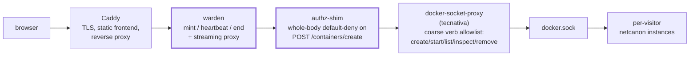
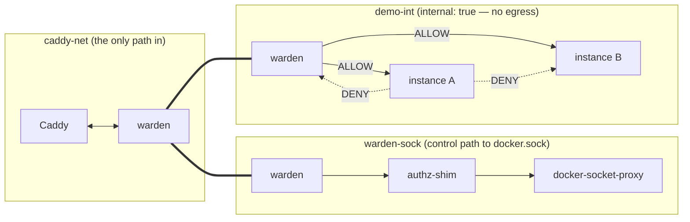
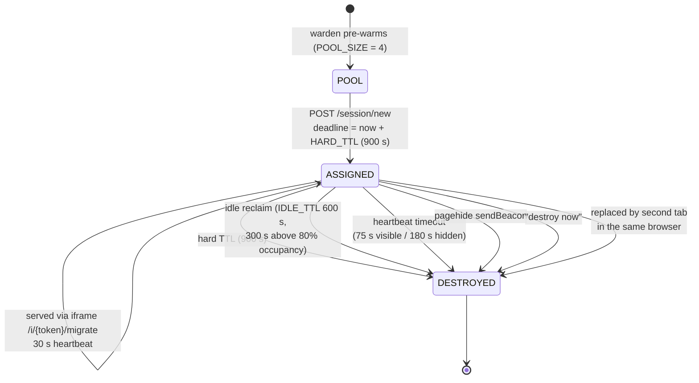

# netcanon public demo — architecture overview

This document is the fast path for a reviewer or contributor who wants to understand the
trust boundaries and request flow of the public ephemeral demo. The full design lives in
[`docs/demo-plan/`](demo-plan/); the trust argument and its proof runbook live in the
[whitepaper](DEMO_WHITEPAPER.md) (served at `/whitepaper`) and [`deploy/VERIFY.md`](../deploy/VERIFY.md).

## Overview

A single small VPS runs Docker plus a hand-built FastAPI **warden** — a session manager and
reverse proxy that is the only stateful service and the core of the Trusted Computing Base.
The warden spawns one hardened, throwaway netcanon container per visitor, keeps a small warm
pool so sessions start instantly, routes each browser to its own instance via a session cookie,
and destroys every instance on a hard TTL regardless of activity. **Caddy** is the sole TLS
terminator; Cloudflare is DNS-only (grey-cloud), so no third party ever sees plaintext traffic.

## Privilege chain

Every hop from the browser to `docker.sock` strips privilege. Left to right:

**What is in the TCB.** The warden and the create-body authz shim are counted in the TCB.
The shim rejects any `POST /containers/create` body that does not byte-for-byte match the
expected hardened spec (default-deny on the whole body, not a field blocklist); the
socket-proxy above it only permits the five coarse verbs the warden needs — no exec, no
attach, no build, no volume or network mutation.

**The honest failure mode.** The warden reaches the Docker socket (through the proxy + shim),
so a compromised warden is host root, and host root voids every guarantee in this document.
The design does not eliminate that risk — it **bounds** it:

- the warden is tiny (≤ 500 lines, `demo/warden/app.py`), so it can actually be read;
- it runs non-root with a read-only filesystem;
- it can reach Docker only through the capability-filtered socket-proxy plus the create-body shim;
- it never `exec`s into instances — all interaction is plain HTTP proxying.

If you don't want to trust any of this, the trust-nothing alternative is running netcanon
locally with `docker run`; the demo exists for convenience, not as a security claim.

## Network topology

Three Docker networks, each carrying exactly one kind of traffic:

- **caddy-net** — Caddy ↔ warden. The only ingress path.
- **warden-sock** — warden → authz-shim → socket-proxy. The only route to `docker.sock`.
- **demo-int** — `internal: true` (no egress). Warden ↔ instances for HTTP proxying only.
  Explicit nftables rules enforce: warden → instance **ALLOW**, instance → instance **DENY**,
  instance → warden **DENY** (instances cannot reach the warden's API). The socket-proxy is
  **not** on demo-int, so an instance can never reach it, even from a compromised container.

## Instance lifecycle

- The reaper ticks every **10 s** and evaluates all destruction conditions.
- Caps: **MAX_ACTIVE = 32** concurrent instances, **PER_IP_MAX_CONCURRENT = 2**.
- The idle window tightens (600 s → 300 s) once occupancy exceeds 80%, so a busy demo
  reclaims faster instead of queueing.

## Hard-TTL enforcement — two independent domains, three mechanisms

No single failure can lift the lifetime ceiling:

| # | Mechanism | Domain | Behavior |
|---|-----------|--------|----------|
| a | In-RAM reaper | warden | Assignment-relative 900 s deadline, checked every 10 s tick. |
| b | Startup label-sweep | warden | On (re)start the warden destroys every `demo.*`-labeled container it finds — it **adopts nothing**, so a restart cannot resurrect or extend a session. |
| c | Host systemd timer | host (independent of the warden) | Every 60 s, force-removes any `demo.*`-labeled container older than `HARD_TTL + POOL_MAX_AGE = 1200 s`, even if the warden is dead. |

A warden crash can therefore widen the effective ceiling from ~15 minutes to at most
~20 minutes — it can never remove it.

## Where the code lives

| Path | What it is |
|------|------------|
| `deploy/` | docker-compose, Caddyfile, cloud-init, systemd units, nftables rules |
| `deploy/VERIFY.md` | The proof runbook — commands to verify every claim above on a live host |
| `demo/warden/app.py` | The warden (session manager + reverse proxy; the TCB core) |
| `demo/warden/authz_shim.py` | The create-body gate (whole-body default-deny) |
| `demo/warden/constants.py` | Single source of truth for every hardening flag and TTL |
| `frontend/` | `index.html` + `whitepaper.html`, served statically by Caddy |
| `tools/render_whitepaper.py` | Renders the whitepaper for `/whitepaper` |
| `docs/DEMO_WHITEPAPER.md` | The trust argument (served at `/whitepaper`) |
| `docs/demo-plan/` | The full design plan this architecture implements |

Start with `constants.py` if you want to audit the hardening surface, `app.py` if you want
to audit the TCB, and `deploy/VERIFY.md` if you want to check the running system rather than
take this document's word for it.
